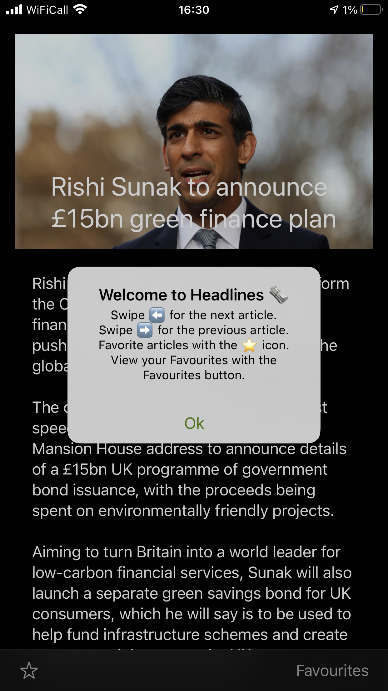
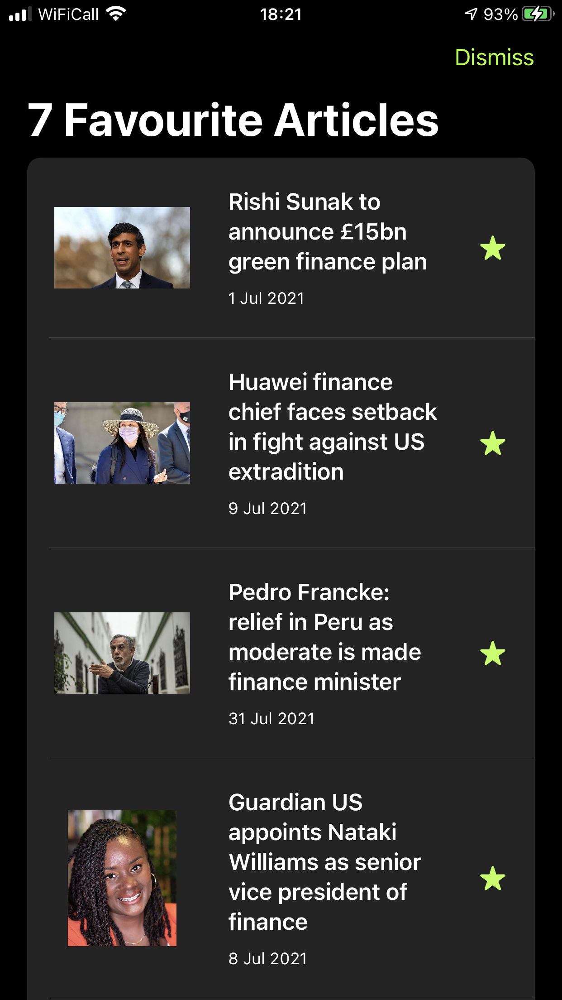
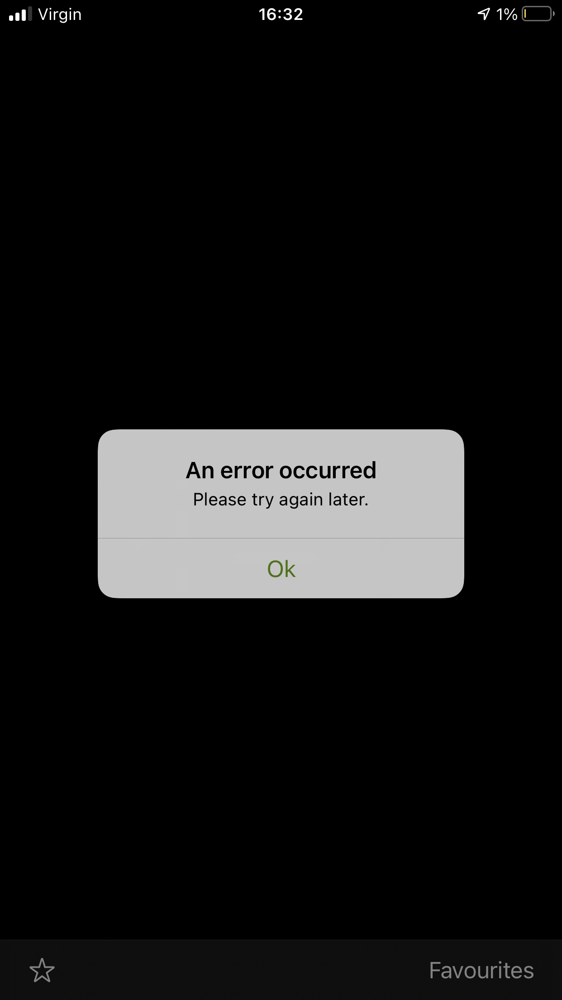

# Headlines

## About

I have been working on an app called "Headlines". The app uses the
Guardian's news API to fetch headlines and display them to the user.
Users can favourite articles that they like.

## Priorities

1. Fully functional, easy to use, stable and well-designed news reader.
2. Prioritising Unit and UI tests with FIRST for business-critical features,
using OHHTTPStubs for basic request stubbing.
3. Following SOLID, OOP, POP and XP principles to write simple, readable,
testable, scalable and maintainable SwiftUI code.
4. Architecting the app using the SwiftUI MVC pattern.
5. Data persistence with Realm.

## What I would have tackled next?

1. Add local notifications to remind users to open the app.
2. Test and improve accessibility support.
3. Add more performance tests for JSON parsing.
4. Add more unit tests for networking layer, in addition to existing UI tests.

## Screenshots

   
